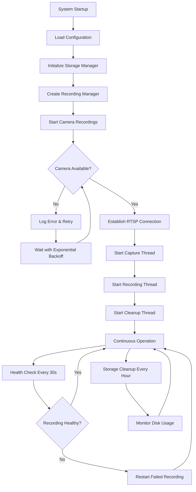
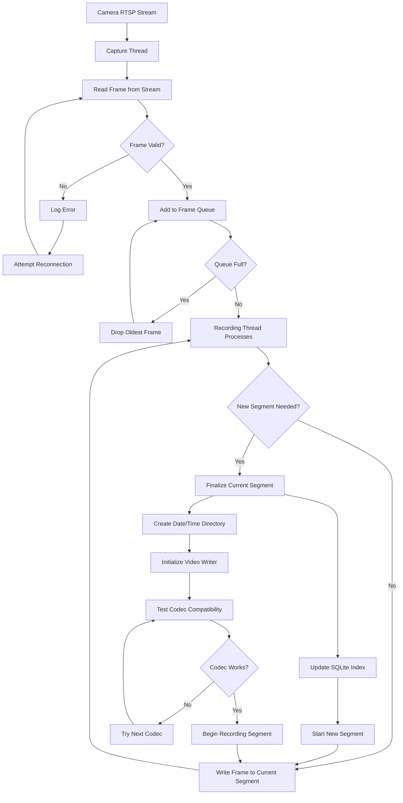
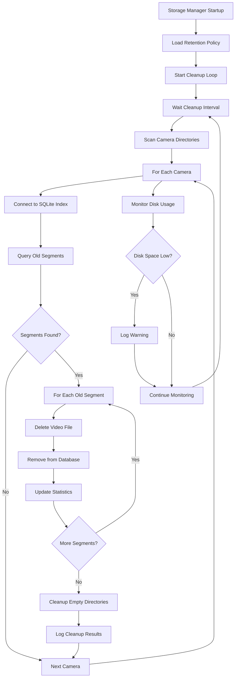
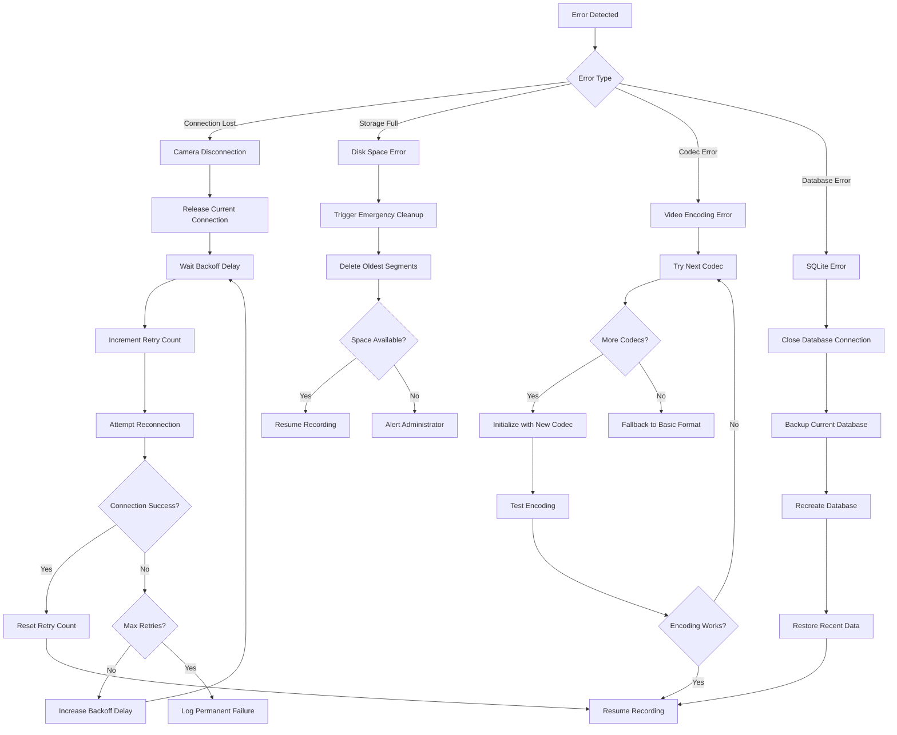
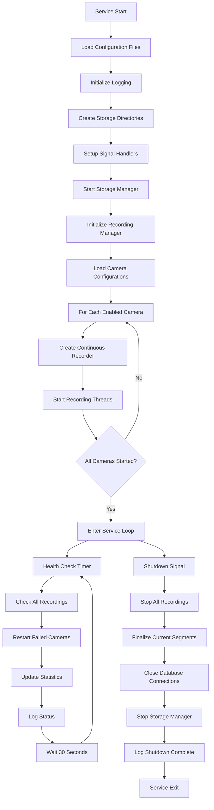
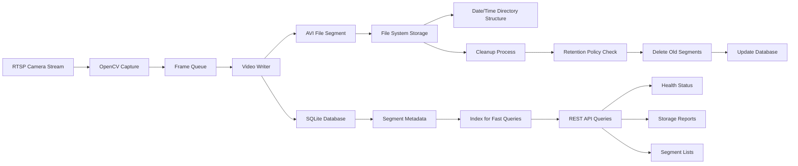
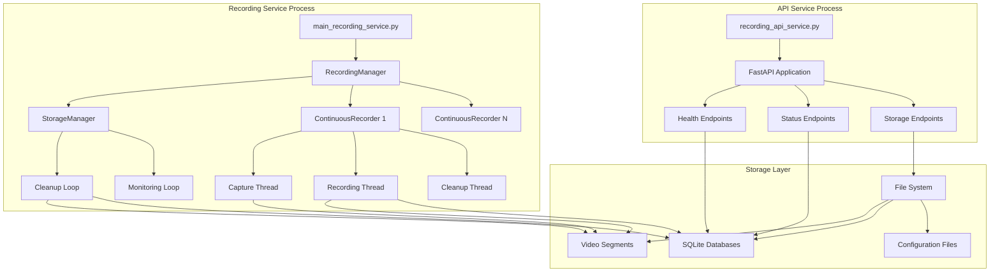

# 24/7 Recording System - Flow Diagrams

This document contains detailed flowcharts and process diagrams for the 24/7 recording system.

## 🔄 System Overview Flowchart



## 📹 Recording Process Flow



## 🗄️ Storage Management Flow



## 🔧 API Service Flow

```mermaid
graph TB
    A[API Request] --> B{Endpoint Type}
    
    B -->|/health| C[Health Check]
    C --> D[Check Recording Directories]
    D --> E[Query SQLite Databases]
    E --> F[Calculate Storage Stats]
    F --> G[Check Disk Usage]
    G --> H[Return Health Status]
    
    B -->|/recordings/status| I[Get All Camera Status]
    I --> J[For Each Camera Directory]
    J --> K[Read SQLite Index]
    K --> L[Calculate Recording Stats]
    L --> M[Check Recent Activity]
    M --> N[Aggregate Results]
    N --> O[Return Status JSON]
    
    B -->|/recordings/{id}/segments| P[Get Camera Segments]
    P --> Q[Validate Camera ID]
    Q --> R{Camera Exists?}
    R -->|No| S[Return 404 Error]
    R -->|Yes| T[Parse Time Parameters]
    T --> U[Query SQLite Database]
    U --> V[Filter by Time Range]
    V --> W[Format Segment Data]
    W --> X[Return Segments JSON]
    
    B -->|/storage/report| Y[Generate Storage Report]
    Y --> Z[Scan All Cameras]
    Z --> AA[Aggregate Statistics]
    AA --> BB[Calculate Disk Usage]
    BB --> CC[Format Report]
    CC --> DD[Return Comprehensive Report]
```

## ⚡ Error Recovery Flow



## 🔄 Service Lifecycle



## 📊 Data Flow Diagram



## 🏗️ Component Architecture



---

**Note:** These flowcharts represent the actual implemented system behavior based on the production code running since July 26, 2025.