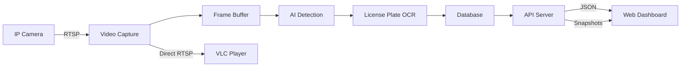

# License Plate Recognition System - Documentation Overview

## 📋 Table of Contents

1. **[Overview & Architecture](./01-overview-architecture.md)** (This document)
2. **[Camera Integration Guide](./02-camera-integration.md)**
3. **[AI Processing Pipeline](./03-ai-processing-pipeline.md)**
4. **[Database Design](./04-database-design.md)**
5. **[Web Dashboard](./05-web-dashboard.md)**
6. **[Live View Solutions](./06-live-view-solutions.md)**
7. **[Deployment Guide](./07-deployment-guide.md)**
8. **[Troubleshooting & FAQ](./08-troubleshooting-faq.md)**

## 🎯 System Overview

### Purpose
Build a reliable License Plate Recognition (LPR) system that:
- Processes IP camera feeds locally
- Detects and recognizes license plates using AI
- Stores results in a database
- Displays analytics in a web dashboard
- Provides live viewing through appropriate tools (NOT browsers)

### Core Principles
1. **Process Locally, Display Remotely** - AI runs where the cameras are
2. **Browser for Data, Not Video** - Show results, snapshots, and analytics
3. **Right Tool for Each Job** - VLC/native apps for live video
4. **Fail Gracefully** - System continues working even if parts fail

## 🏗️ System Architecture

```
┌─────────────────┐     ┌─────────────────┐     ┌─────────────────┐
│   IP Cameras    │     │ Local PC/Server │     │  Web Browser    │
│                 │────▶│                 │────▶│                 │
│ • RTSP Stream   │     │ • Capture       │     │ • Dashboard     │
│ • H.264/H.265   │     │ • AI Process    │     │ • Analytics     │
│ • Network       │     │ • Store         │     │ • Snapshots     │
└─────────────────┘     └─────────────────┘     └─────────────────┘
                                 │
                                 ▼
                        ┌─────────────────┐
                        │  VLC/Native App │
                        │                 │
                        │ • Live Viewing  │
                        │ • Direct RTSP   │
                        └─────────────────┘
```

## ⚠️ Critical Rules for AI Agents

### MUST Follow:
1. **NEVER attempt to stream RTSP directly to browsers**
2. **NEVER transcode video in real-time for web display**
3. **ALWAYS process video locally where cameras are**
4. **ALWAYS use appropriate video tools for live viewing**
5. **ALWAYS separate data display from video display**

### MUST Avoid:
1. **Browser video streaming** - Use snapshots instead
2. **Network video processing** - Process at the edge
3. **Synchronous video handling** - Use async patterns
4. **Single points of failure** - Build redundancy

## 🔧 Technology Stack

### Backend (Local Processing)
```python
# Core technologies
{
    "language": "Python 3.9+",
    "video_capture": "OpenCV (cv2)",
    "ai_framework": "YOLOv8 + EasyOCR",
    "database": "PostgreSQL",
    "api_framework": "FastAPI",
    "task_queue": "Celery + Redis"
}
```

### Frontend (Web Dashboard)
```javascript
// Dashboard technologies
{
    "framework": "React or Vue.js",
    "charts": "Chart.js or D3.js",
    "styling": "Tailwind CSS",
    "state": "Redux or Pinia",
    "api": "Axios or Fetch"
}
```

### Live Viewing
```yaml
options:
  - name: "VLC Media Player"
    protocol: "Direct RTSP"
    platforms: ["Windows", "Mac", "Linux"]
    
  - name: "Native Python App"
    framework: "PyQt5 or Tkinter"
    advantage: "Custom controls"
    
  - name: "Mobile App"
    framework: "React Native"
    advantage: "Remote viewing"
```

## 📊 Data Flow



## 🚀 Quick Start Path

1. **Week 1**: Camera integration and basic capture
2. **Week 2**: AI pipeline implementation
3. **Week 3**: Database and API development
4. **Week 4**: Dashboard creation
5. **Week 5**: Live viewing integration
6. **Week 6**: Testing and deployment

## 📝 Document Structure

Each subsequent document follows this template:

```markdown
# Document Title

## Prerequisites
- What you need before starting this section

## Overview
- What this document covers
- Expected outcomes

## Step-by-Step Implementation
- Detailed code examples
- Configuration samples
- Testing procedures

## Common Pitfalls
- What to avoid
- Why it matters
- Better alternatives

## Verification
- How to test it works
- Expected outputs
- Troubleshooting steps

## Next Steps
- Link to next document
- What to prepare
```

## 🎓 Learning from Industry

### What Security Companies Do:
- **Avigilon**: Edge AI appliances + thick clients
- **Milestone**: VMS software + plugin architecture  
- **Verkada**: Camera-level processing + cloud dashboards
- **Frigate**: Local processing + Home Assistant integration

### What They DON'T Do:
- Stream raw video to browsers
- Process video in the cloud
- Rely on browser video players
- Use real-time transcoding

## ✅ Success Criteria

Your system is successful when:
1. Captures from multiple IP cameras reliably
2. Detects >95% of visible license plates
3. Stores all detections with metadata
4. Dashboard loads in <2 seconds
5. Live view works without affecting processing
6. System runs 24/7 without intervention

## 🔗 Next Document

Continue to: **[02 - Camera Integration Guide](./02-camera-integration.md)**

---

*Note for AI Agents: This architecture is battle-tested and avoids common pitfalls. Do not deviate from the core principle: process locally, display data remotely, use proper tools for video.*