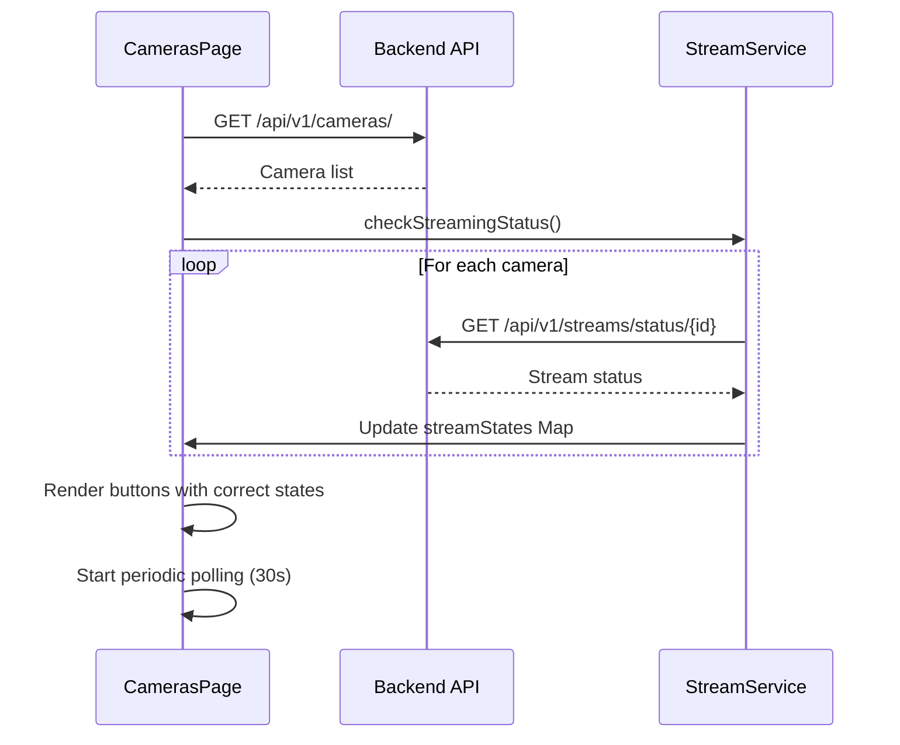
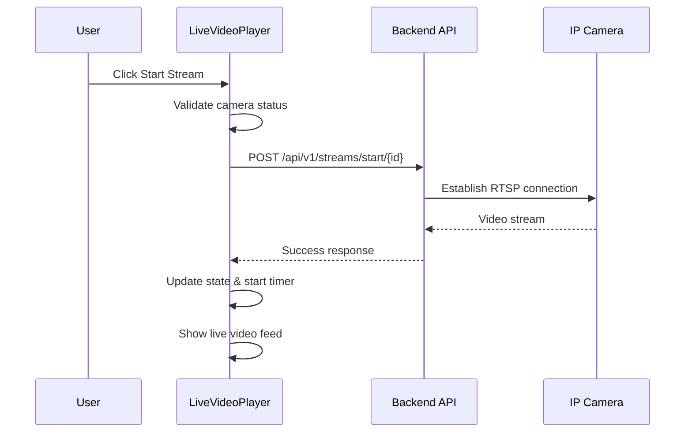
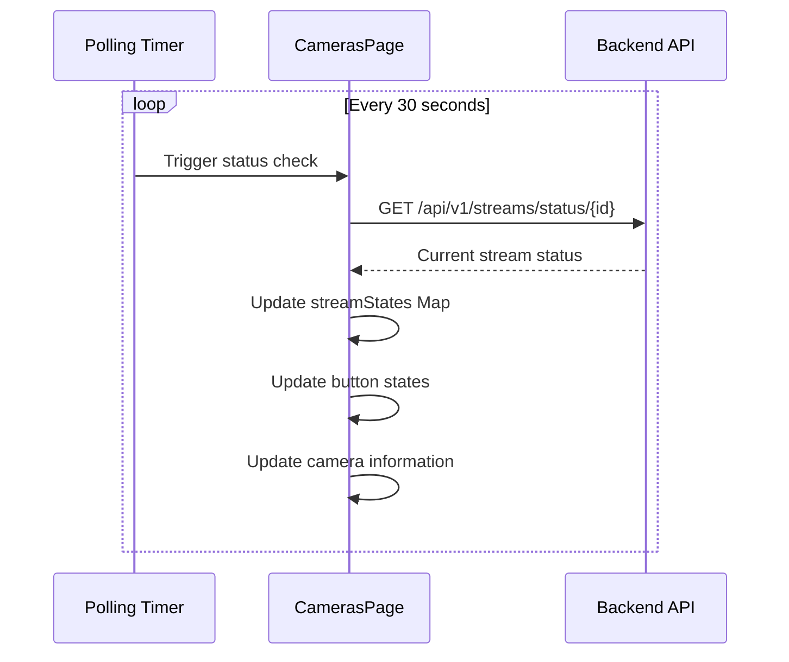

# 🎥 Current Streaming Architecture Documentation

**Date**: 2025-07-25  
**Status**: ✅ **IMPLEMENTED**  
**Version**: v2.0 - Enhanced Streaming Integration

## 🎯 Overview

This document describes the current streaming architecture implementation that provides real-time video streaming integration directly in the camera management interface. The system eliminates the need for separate streaming pages and provides seamless live video integration with enhanced state management and error handling.

## 🏗️ Architecture Components

### Backend Components

#### Streaming API Endpoints
```
/api/v1/streams/start/{camera_id}    # POST - Start streaming
/api/v1/streams/stop/{camera_id}     # POST - Stop streaming  
/api/v1/streams/status/{camera_id}   # GET  - Check stream status
/stream/video/{camera_id}            # GET  - Video stream endpoint
/stream/thumbnail/{camera_id}        # GET  - Thumbnail endpoint
```

#### Stream Management Service
- **CameraStreamingService**: Core streaming logic
- **Active Streams Dictionary**: Global state management (`active_streams: Dict[int, CameraStreamingService]`)
- **Stream Configuration**: Quality, FPS, detection settings
- **Real-time Status Tracking**: Active, stopped, error, connecting states

### Frontend Components

#### LiveVideoPlayer Component
**Location**: `/frontend/src/components/streaming/LiveVideoPlayer.js`

**Key Features**:
- Reusable streaming component for any camera feed
- Configurable controls (can be disabled for external control)
- Real-time duration tracking with timer management
- Enhanced fullscreen with loading/error states
- Backend status synchronization

**Configuration Options**:
```javascript
const player = new LiveVideoPlayer({
    cameraId: '3',
    camera: cameraObject,
    autoStart: false,
    showControls: false,  // Disable hover controls for external buttons
    className: 'camera-card-player',
    onStatusChange: (status) => handleStatusChange(status),
    onError: (error) => handleError(error),
    onStreamStart: () => handleStreamStart(),
    onStreamStop: () => handleStreamStop()
});
```

#### CamerasPage Integration  
**Location**: `/frontend/src/pages/CamerasPage.js`

**Stream State Management**:
- `streamStates: Map()` - Tracks streaming state per camera
- `videoPlayers: Map()` - Stores LiveVideoPlayer instances
- `streamTimers: Map()` - Manages duration timers
- `statusPollingInterval` - Periodic backend sync

**Key Methods**:
- `checkStreamingStatus()` - Initial status sync on page load
- `startStatusPolling()` - Periodic polling every 30 seconds
- `updateStreamControlButtons()` - Dynamic button state updates
- `updateCameraInfo()` - Real-time camera information updates

## 🔄 Stream Control Flow

### 1. Page Initialization


### 2. Stream Start Operation


### 3. Status Synchronization


## 🎛️ User Interface Components

### External Stream Controls
The current implementation uses external buttons below the video player instead of hover controls:

```html
<div class="camera-card-stream-controls">
    <button class="btn btn-success/btn-danger btn-small" 
            data-action="start-stream/stop-stream" 
            data-camera-id="{id}">
        <i class="fas fa-play/fa-stop"></i>
        Start/Stop
    </button>
    <button class="btn btn-info btn-small" 
            data-action="capture" 
            data-camera-id="{id}">
        <i class="fas fa-camera"></i>
        Capture
    </button>
    <button class="btn btn-primary btn-small" 
            data-action="fullscreen" 
            data-camera-id="{id}">
        <i class="fas fa-expand"></i>
        Full Screen
    </button>
</div>
```

### Enhanced Camera Information Display
Real-time operational stats instead of technical specifications:

```javascript
// Dynamic camera information
const cameraInfo = {
    location: camera.location,
    healthScore: calculateHealthScore(camera),
    uptime: camera.uptime,
    streamDuration: isStreaming ? "MM:SS" : null,  // Live counter
    lastSeen: camera.status === 'offline' ? relativeTime : null,
    connection: `${camera.connectionType.toUpperCase()} (${camera.ipAddress})`
};
```

### Fullscreen Implementation
Enhanced fullscreen modal with proper loading and error handling:

**Features**:
- Loading spinner while stream initializes
- 10-second timeout with error message
- Auto-start stream if not already active
- Keyboard (ESC) and click-outside close
- Proper error fallback with retry option

## 🔧 State Management

### Stream State Synchronization
```javascript
// Initial state check on page load
async checkStreamingStatus() {
    for (const camera of this.cameras) {
        const response = await fetch(`/api/v1/streams/status/${camera.id}`);
        const statusData = await response.json();
        const isStreaming = statusData.status === 'active';
        
        this.streamStates.set(camera.id, isStreaming);
        
        if (isStreaming) {
            this.startStreamTimer(camera.id);
        }
    }
}

// Periodic sync every 30 seconds
startStatusPolling() {
    this.statusPollingInterval = setInterval(async () => {
        await this.checkStreamingStatus();
        this.updateAllCameraStates();
    }, 30000);
}
```

### Button State Management
```javascript
updateStreamControlButtons(cameraId) {
    const isStreaming = this.streamStates.get(cameraId) || false;
    const startStopBtn = document.querySelector(`[data-action*="stream"][data-camera-id="${cameraId}"]`);
    
    if (startStopBtn) {
        if (isStreaming) {
            startStopBtn.className = 'btn btn-danger btn-small';
            startStopBtn.title = 'Stop Stream';
            startStopBtn.dataset.action = 'stop-stream';
            startStopBtn.innerHTML = '<i class="fas fa-stop"></i> Stop';
        } else {
            startStopBtn.className = 'btn btn-success btn-small';
            startStopBtn.title = 'Start Stream';
            startStopBtn.dataset.action = 'start-stream';
            startStopBtn.innerHTML = '<i class="fas fa-play"></i> Start';
        }
    }
}
```

## 🛡️ Error Handling & Validation

### Stream Validation
```javascript
async startStream() {
    // Validate camera is online
    if (this.camera?.status !== 'online') {
        this.onError(`Cannot start stream: Camera is ${this.camera?.status || 'offline'}`);
        return;
    }
    
    // Check backend health
    const healthCheck = await this.checkBackendConnection();
    if (!healthCheck) {
        throw new Error('Backend service unavailable');
    }
    
    // Check if already streaming
    const statusResponse = await fetch(`/api/v1/streams/status/${this.cameraId}`);
    if (statusResponse.ok) {
        const statusData = await statusResponse.json();
        if (statusData.status === 'active') {
            // Update local state to match backend
            this.syncWithBackendState();
            return;
        }
    }
}
```

### Fullscreen Error Handling
```javascript
// Enhanced fullscreen with loading and error states
const fullscreenHTML = `
    <div class="fullscreen-loading" id="fullscreen-loading-${this.cameraId}">
        <i class="fas fa-spinner fa-spin"></i>
        <span>Loading stream...</span>
    </div>
    
    <div class="fullscreen-error" style="display: none;">
        <i class="fas fa-exclamation-triangle"></i>
        <h4>Stream Not Available</h4>
        <p>Unable to load video stream. Camera may be offline.</p>
        <button onclick="location.reload()">Retry</button>
    </div>
`;
```

## 📊 Performance Optimizations

### Efficient State Updates
- **Minimal Re-rendering**: Update only specific UI elements instead of full page refresh
- **Debounced Polling**: 30-second intervals to balance real-time updates with performance
- **Timer Management**: Proper cleanup of intervals and timeouts
- **Event-driven Updates**: React to stream events rather than constant polling

### Memory Management
```javascript
// Proper cleanup in destroy method
destroy() {
    this.stopStatusPolling();
    
    this.videoPlayers.forEach(player => player.destroy());
    this.videoPlayers.clear();
    
    this.streamTimers.forEach(timer => clearInterval(timer));
    this.streamTimers.clear();
    
    this.streamStates.clear();
}
```

## 🔍 Debugging & Troubleshooting

### Common Issues and Solutions

**Issue**: Buttons show wrong state (Start instead of Stop)
**Solution**: Check browser console for sync errors, verify backend status
```bash
curl http://localhost:8001/api/v1/streams/status/3
```

**Issue**: Fullscreen shows black screen
**Solution**: Verify stream endpoint and check camera connection
```bash
curl -I http://localhost:8001/stream/video/3
```

**Issue**: Stream won't start
**Solution**: Check camera status and backend logs
```bash
curl http://localhost:8001/api/v1/cameras/
```

### Browser Console Debugging
```javascript
// Check streaming states in browser console
console.log('Current stream states:', window.camerasPageInstance?.streamStates);

// Check video player instances
console.log('Video players:', window.camerasPageInstance?.videoPlayers);

// Manual status check
await window.camerasPageInstance?.checkStreamingStatus();
```

## 🚀 Future Enhancements

### Planned Improvements
1. **WebSocket Integration**: Real-time status updates instead of polling
2. **Stream Quality Controls**: Dynamic quality adjustment
3. **Multiple Stream Support**: Simultaneous streams from multiple cameras
4. **Stream Recording**: Save video streams locally
5. **Stream Analytics**: Bandwidth usage, FPS monitoring, connection quality

### Phase 2 Features
- **AI Detection Integration**: Real-time license plate detection overlay
- **Stream Alerts**: Automated alerts based on detection events
- **Stream Sharing**: Share live streams with external users
- **Mobile Optimization**: Enhanced mobile streaming experience

## 📝 API Reference

### Stream Control Endpoints

#### Start Stream
```http
POST /api/v1/streams/start/{camera_id}
Content-Type: application/json

{
    "quality": "medium",        # low, medium, high
    "max_fps": 30,             # Maximum frames per second
    "detection_enabled": false  # Enable AI detection (Phase 2)
}
```

#### Stream Status
```http
GET /api/v1/streams/status/{camera_id}

Response:
{
    "camera_id": 3,
    "camera_name": "Test Camera 1",
    "status": "active",         # active, stopped, error, connecting
    "current_fps": null,
    "queue_size": 0,
    "settings": {
        "quality": "medium",
        "max_fps": 30,
        "jpeg_quality": 80
    }
}
```

#### Video Stream
```http
GET /stream/video/{camera_id}?quality=medium

# Returns MJPEG stream for browser consumption
Content-Type: multipart/x-mixed-replace; boundary=frame
```

---

**Last Updated**: 2025-07-25  
**Author**: Claude Code AI Assistant  
**Status**: Production Ready ✅