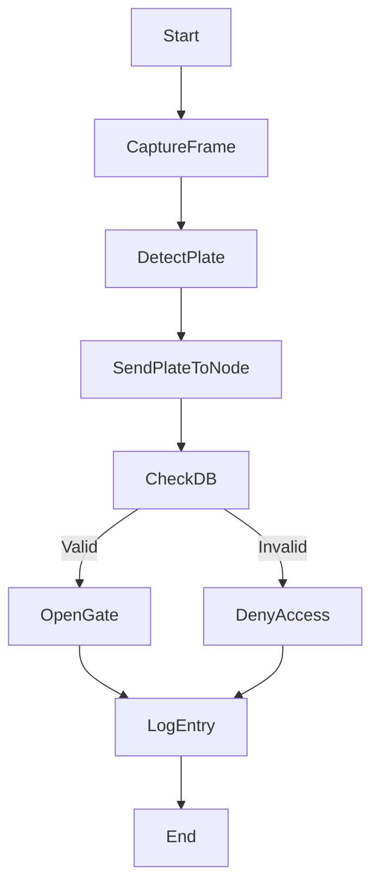

# Logic Flow for Smart Gate LPR Overlay

## Explanation:
- `CaptureFrame`: FastAPI reads camera feed.
- `DetectPlate`: Frame processed via ML model to extract license plate.
- `SendPlateToNode`: Result sent as JSON to Node.js service.
- `CheckDB`: Node.js compares plate with access table.
- `OpenGate` / `DenyAccess`: Decides physical gate action.
- `LogEntry`: Saves event to `entry_logs` table.
