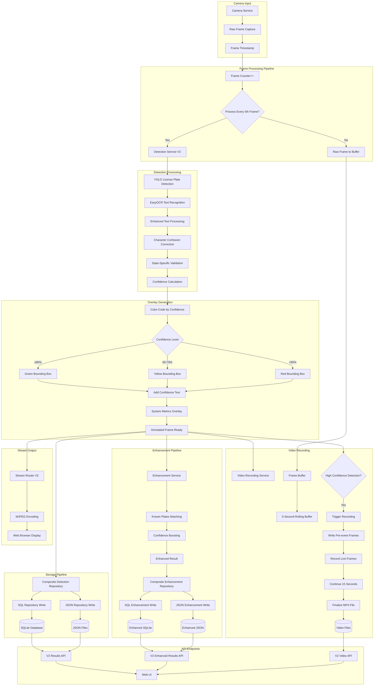
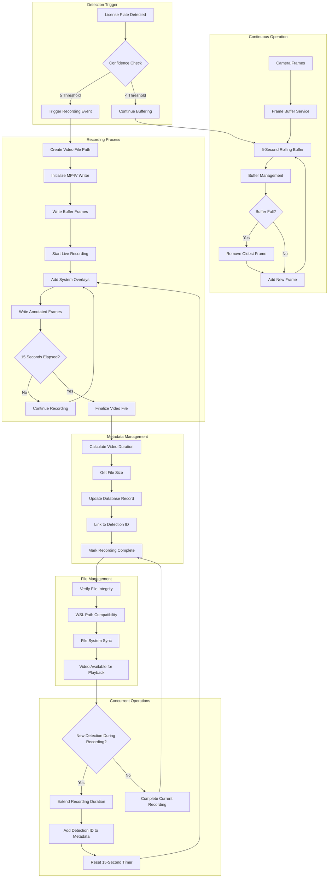
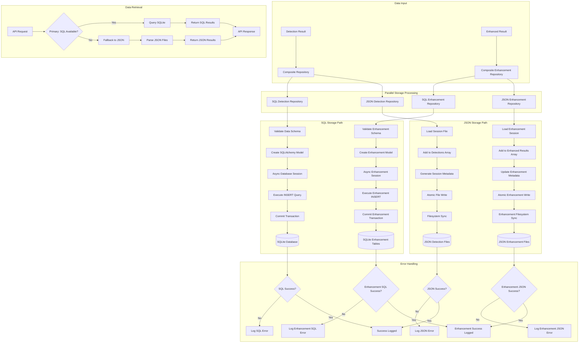
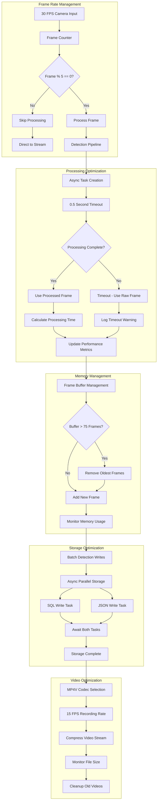
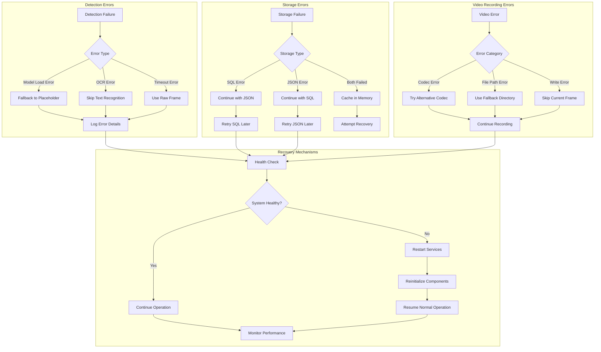

# V2 System Workflow - License Plate Recognition

**Version:** 2.0  
**Last Updated:** 2025-06-10  
**Authors:** Development Team  

## Overview

This document presents the enhanced workflow diagrams for the V2 License Plate Recognition System, illustrating the improved data flow, video recording pipeline, and dual storage architecture.

## Main System Workflow



## Detection Processing Detail Flow

```mermaid
graph TB
    A[Raw Frame Input] --> B[YOLO Model Processing]
    B --> C[Bounding Box Detection]
    C --> D{License Plate Found?}
    
    D -->|No| E[Return Raw Frame]
    D -->|Yes| F[Extract Plate ROI]
    
    F --> G[EasyOCR Processing]
    G --> H[Text Elements with Bounding Boxes]
    H --> I[Size-Based Filtering]
    
    subgraph "Enhanced Text Processing"
        I --> J[Remove State Names]
        J --> K[Remove Dealer Text]
        K --> L[Remove State Slogans]
        L --> M[Score Text Elements]
        M --> N[Select Best Candidate]
    end
    
    subgraph "Text Scoring Algorithm"
        N --> O[Base OCR Confidence: 40%]
        O --> P[Size Bonus: 30%]
        P --> Q[Position Bonus: 15%]
        Q --> R[Length Bonus: 15%]
        R --> S[Pattern Match: 20%]
        S --> T[Character Mix: 10%]
        T --> U[Final Score]
    end
    
    subgraph "Character Correction"
        U --> V[Apply Confusion Matrix]
        V --> W{Texas Plate?}
        W -->|Yes| X[Texas-Specific Rules]
        W -->|No| Y[General Corrections]
        X --> Z[Corrected Text]
        Y --> Z
    end
    
    subgraph "Validation"
        Z --> AA[Pattern Validation]
        AA --> BB[State Pattern Check]
        BB --> CC[Length Validation]
        CC --> DD[Character Composition]
        DD --> EE[Final Confidence]
    end
    
    subgraph "Overlay Creation"
        EE --> FF[Calculate Average Confidence]
        FF --> GG{Confidence Threshold}
        GG -->|≥80%| HH[Green Color: #00FF00]
        GG -->|60-79%| II[Yellow Color: #FFFF00]
        GG -->|<60%| JJ[Red Color: #FF0000]
        HH --> KK[Draw Bounding Box]
        II --> KK
        JJ --> KK
        KK --> LL[Add Text: 'TX: ABC123 (87%/92%)']
        LL --> MM[Add Background Rectangle]
        MM --> NN[Annotated Frame Output]
    end
```

## Video Recording Workflow



## Dual Storage Architecture Flow



## Service Factory Initialization Flow

```mermaid
graph TB
    subgraph "Application Startup"
        A[main_v2.py Start] --> B[Load Configuration]
        B --> C[Create Service Factory]
        C --> D[Set Factory Config]
    end
    
    subgraph "Repository Creation"
        D --> E[Create Detection Repository]
        E --> F[Initialize SQL Detection Repo]
        F --> G[Initialize JSON Detection Repo]
        G --> H[Create Composite Detection Repo]
        
        H --> I[Create Enhancement Repository]
        I --> J[Initialize SQL Enhancement Repo]
        J --> K[Initialize JSON Enhancement Repo]
        K --> L[Create Composite Enhancement Repo]
        
        L --> M[Create Video Repository]
        M --> N[Initialize SQL Video Repo]
    end
    
    subgraph "Service Creation"
        N --> O[Create Camera Service]
        O --> P[Create License Plate Detector]
        P --> Q[Create Enhancer Service]
        Q --> R[Create Video Recording Service]
        R --> S[Create Detection Service V2]
    end
    
    subgraph "Dependency Injection"
        S --> T[Inject Camera into Detection Service]
        T --> U[Inject Detector into Detection Service]
        U --> V[Inject Repositories into Detection Service]
        V --> W[Inject Enhancer into Detection Service]
        W --> X[Inject Video Service into Detection Service]
    end
    
    subgraph "Service Initialization"
        X --> Y[Initialize All Services]
        Y --> Z[Verify Dependencies]
        Z --> AA[Start Background Tasks]
        AA --> BB[Set App State Services]
    end
    
    subgraph "Router Configuration"
        BB --> CC[Configure V2 Routers]
        CC --> DD[Set Router Dependencies]
        DD --> EE[Enable V1 Compatibility]
        EE --> FF[Start FastAPI Application]
    end
    
    subgraph "Ready State"
        FF --> GG[System Ready]
        GG --> HH[Accept API Requests]
        HH --> II[Process Video Stream]
        II --> JJ[Handle Detection Events]
    end
```



## Performance Optimization Flow



## Error Handling and Recovery Flow



This comprehensive workflow documentation provides a detailed view of the V2 system's enhanced capabilities, showing how the various components interact to provide robust license plate recognition with advanced video recording and dual storage features.