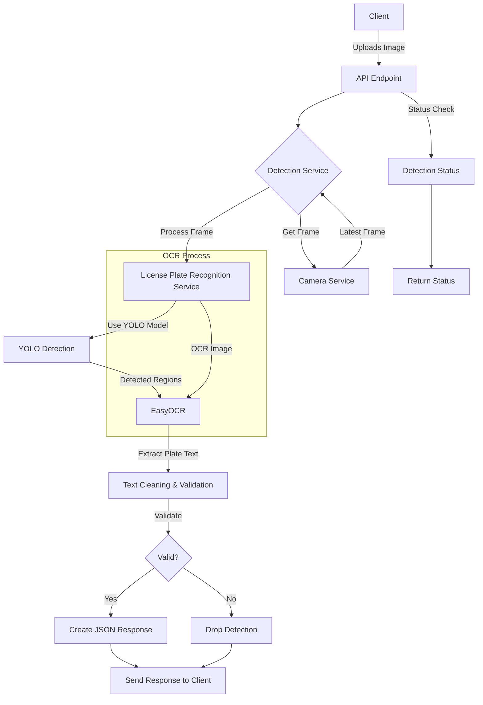

# License Plate Recognition Framework

## Overview

This document describes the architecture of the license plate recognition framework.

## Flowchart

```mermaid
flowchart TD
    A[Client] -->|Uploads Image| B[API Endpoint]
    B --> C{Detection Service}
    C -->|Get Frame| D[Camera Service]
    D -->|Latest Frame| C
    C -->|Process Frame| E[License Plate Recognition Service]
    E -->|Use YOLO Model| F[YOLO Detection]
    F -->|Detected Regions| G[EasyOCR]
    G -->|Extract Plate Text| H[Text Cleaning & Validation]
    H -->|Validate| I{Valid?}
    I -->|Yes| J[Create JSON Response]
    I -->|No| K[Drop Detection]
    J --> L[Send Response to Client]
    K --> L
    subgraph OCR Process
    E -->|OCR Image| G
    end
    B -->|Status Check| M[Detection Status]
    M --> N[Return Status]
```