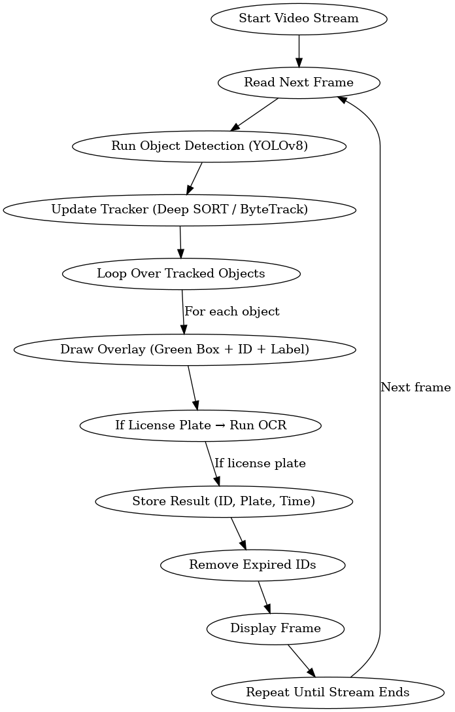

# Object Detection & License Plate Recognition Logic

## 📹 Main Loop

```plaintext
WHILE video stream is active:
    Read next frame from camera

    # 1. Object Detection
    detected_objects = object_detector(frame)

    # 2. Object Tracking
    tracked_objects = object_tracker.update(detected_objects)

    # 3. Overlay and Recognition
    FOR obj IN tracked_objects:
        id = obj.id
        class_name = obj.class_name
        bbox = obj.bbox
        confidence = obj.confidence

        draw_rectangle(frame, bbox, color='green')
        draw_text(frame, f"{class_name} | ID: {id}", bbox)

        IF class_name == "license_plate":
            plate_img = crop(frame, bbox)
            plate_text = run_ocr(plate_img)
            store_result(id, plate_text, timestamp)

    # 4. Cleanup
    remove_old_ids(tracked_objects, frame_count)

    # 5. Display
    show_frame(frame)
```

---

## 🧠 Component Logic

### 1. Object Detection
- Detects license plates, cars, etc.
- Outputs: `class_name`, `bbox`, `confidence`

### 2. Object Tracking
- Tracks across frames
- Assigns consistent ID
- Uses: Deep SORT, ByteTrack

### 3. Overlay Drawing
- Green bounding box
- Label with ID and class
- Optional: trails, color coding

### 4. OCR (for License Plates)
- Run only for license_plate class
- Crop and enhance image
- Apply OCR (e.g., EasyOCR/Tesseract)
- Store result with metadata

### 5. ID Expiry
- Remove if not seen for N frames
- Keep memory clean

---

## 💾 Result Format

```json
{
  "id": 12,
  "plate": "ABC1234",
  "confidence": 0.94,
  "first_seen": "2025-06-16 14:02:01",
  "last_seen": "2025-06-16 14:02:08",
  "frames_visible": 34
}
```

---

## 🗺️ Flowchart


