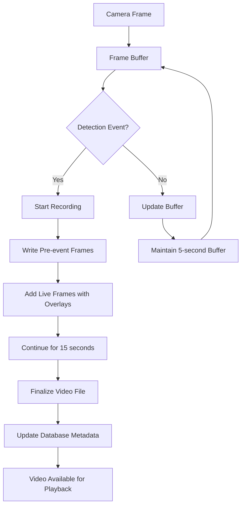

# Enhanced Features - V2 License Plate Recognition System

**Version:** 2.0  
**Last Updated:** 2025-06-10  
**Authors:** Development Team  

## Overview

This document details the enhanced features introduced in V2 of the License Plate Recognition System, focusing on video recording improvements, confidence-based overlays, dual storage capabilities, and enhanced recognition accuracy.

## Video Recording Enhancements

### Annotated Video Recording

The V2 system records video clips with rich overlay information instead of plain video feeds.

#### **Confidence Overlays**
Each detected license plate displays comprehensive confidence information:

```
TX: ABC123 (87%/92%)
```

- **State Prefix**: Detected state abbreviation (TX, CA, etc.)
- **Plate Text**: Recognized license plate characters
- **Dual Confidence**: OCR confidence / Detection confidence percentages

#### **Color-Coded Bounding Boxes**
Visual confidence indicators using color psychology:

| Confidence Range | Color | Meaning |
|------------------|--------|---------|
| ≥ 80% | 🟢 Green | High confidence - reliable detection |
| 60-79% | 🟡 Yellow | Medium confidence - likely accurate |
| < 60% | 🔴 Red | Low confidence - needs verification |

#### **System Information Overlays**
Real-time system metrics displayed on video:

- **Timestamp**: Precise date/time with milliseconds
- **Frame Counter**: Current frame number in session
- **Detection Count**: Total detections in current session
- **Session Uptime**: Hours:Minutes:Seconds format
- **Processing Time**: Frame processing duration in milliseconds
- **Processing Rate**: "Every N frames" indicator

### Video Recording Workflow



#### **Recording Specifications**
- **Pre-event Buffer**: 5 seconds of footage before detection
- **Post-event Duration**: 15 seconds after detection trigger
- **Frame Rate**: 15 FPS (optimized for file size/quality)
- **Codec**: MP4V for broad compatibility
- **Resolution**: Matches camera input (typically 1280x720)

## Enhanced License Plate Recognition

### Texas Plate Improvements

Special handling for Texas license plates addressing common recognition issues:

#### **Problem Addressed**
- Texas plates have "TEXAS" text above the license number
- OCR often reads state name characters as part of the plate number
- Example: "TEXAS VBR-7660" incorrectly read as "CETOYOIA"

#### **Solution Implementation**
```python
# Size-based text filtering
def _select_best_plate_text_enhanced(self, text_elements, state_code):
    # Filter out state names and dealer text
    filtered_elements = []
    for element in text_elements:
        text = element["text"].upper()
        
        # Skip state names
        if text in STATE_NAMES:
            continue
            
        # Skip dealer/frame text
        if any(word in text for word in DEALER_FRAME_WORDS):
            continue
            
        # Prioritize larger, centered text elements
        if element["relative_area"] >= 0.05:  # At least 5% of image
            filtered_elements.append(element)
```

#### **Enhanced Filtering Lists**
- **STATE_NAMES**: All 50 US states and territories
- **DEALER_FRAME_WORDS**: Common dealership and frame text
- **STATE_SLOGANS**: State motto text that appears on plates

### Character Confusion Correction

Addresses common OCR misreads with intelligent correction:

#### **Confusion Matrix**
| Character | Often Confused With | Context |
|-----------|-------------------|---------|
| I | T, 1 | Vertical lines |
| O | 0, D | Circular shapes |
| 8 | B | Similar curves |
| 5 | S | Angular similarities |
| Z | 2 | Angular shapes |

#### **Correction Algorithm**
```python
def _apply_character_corrections(self, text, state_code):
    # Texas-specific corrections
    if state_code == "TX" and len(text) == 7:
        if text[0:3].isalpha() and text[3:].isdigit():
            if text[2] == 'I':  # Common confusion in 3rd position
                text = text[0:2] + 'T' + text[3:]
    
    # General corrections based on confusion matrix
    for i, char in enumerate(text):
        if char in self.char_confusion:
            for potential in self.char_confusion[char]:
                candidate = text[:i] + potential + text[i+1:]
                if self._is_valid_pattern(candidate, state_code):
                    return candidate
    
    return text
```

### Bounding Box Analysis

Advanced OCR processing using spatial text analysis:

#### **Text Element Scoring**
Each detected text element receives a score based on:

1. **OCR Confidence** (40 points max): Base confidence from EasyOCR
2. **Size Bonus** (30 points max): Larger text more likely to be plate number
3. **Position Bonus** (15 points max): Centered text preferred
4. **Length Bonus** (15 points max): 5-8 characters optimal for plates
5. **Pattern Matching** (20 points max): Matches state-specific patterns
6. **Character Composition** (10 points max): Mix of letters and numbers

#### **Spatial Analysis**
```python
# Calculate text element properties
text_width = max(x_coords) - min(x_coords)
text_height = max(y_coords) - min(y_coords)
center_x = (min(x_coords) + max(x_coords)) / (2 * width)
center_y = (min(y_coords) + max(y_coords)) / (2 * height)
relative_area = (text_width * text_height) / (width * height)

# Score based on centrality and size
center_x_bonus = 10 * (1 - abs(center_x - 0.5) * 2)  # Max 10 for center
size_bonus = min(relative_area * 100, 30)  # Cap at 30 points
```

## Dual Storage Implementation

### Composite Repository Pattern

V2 implements a sophisticated dual storage approach:

#### **Storage Architecture**
```python
class CompositeDetectionRepository(DetectionRepository):
    def __init__(self, sql_repository, json_repository):
        self.sql_repository = sql_repository      # Primary: SQLite
        self.json_repository = json_repository    # Secondary: JSON files
    
    async def add_detections(self, detections):
        # Write to both repositories simultaneously
        await self.sql_repository.add_detections(detections)
        await self.json_repository.add_detections(detections)
```

#### **Storage Benefits**
- **Redundancy**: Data never lost due to single storage failure
- **Performance**: SQL for queries, JSON for debugging
- **Compatibility**: Maintains V1 JSON format support
- **Export**: Easy data export via JSON files
- **Debugging**: Human-readable JSON for troubleshooting

### JSON File Structure

Enhanced JSON format with additional metadata:

```json
{
  "session_info": {
    "session_id": "session_20250610_023456",
    "start_time": 1733881496.123,
    "version": "2.0",
    "enhanced_features": true
  },
  "detections": [
    {
      "detection_id": "det_abc123",
      "timestamp": 1733881500.456,
      "plate_text": "ABC123",
      "raw_text": "ABC 123",
      "confidence": 0.87,
      "ocr_confidence": 0.84,
      "detection_confidence": 0.92,
      "state": "TX",
      "box": [200, 180, 440, 240],
      "frame_id": 1205,
      "tracking_id": "trk_001",
      "enhanced": true,
      "video_path": "data/videos/2025-06-10/det_abc123_1733881500.mp4"
    }
  ]
}
```

## Performance Optimizations

### Frame Processing Efficiency

#### **Adaptive Processing**
- **Smart Intervals**: Only process every 5th frame during active detection
- **Timeout Protection**: 0.5-second timeout prevents blocking
- **Dynamic Adjustment**: Frame rate adapts to processing capacity

#### **Memory Management**
- **Buffer Optimization**: 5-second rolling buffer (75 frames at 15 FPS)
- **Efficient Encoding**: MP4V codec for optimal compression
- **Cleanup**: Automatic cleanup of old video files

### Storage Performance

#### **Async Operations**
```python
async def add_detections(self, detections):
    # Parallel writes to both repositories
    sql_task = asyncio.create_task(
        self.sql_repository.add_detections(detections)
    )
    json_task = asyncio.create_task(
        self.json_repository.add_detections(detections)
    )
    
    # Wait for both to complete
    await asyncio.gather(sql_task, json_task)
```

#### **Batch Processing**
- **Grouped Writes**: Multiple detections written together
- **Transaction Safety**: Database transactions ensure consistency
- **Error Recovery**: Failed operations don't affect other storage

## Quality Assurance Features

### Confidence Analysis

#### **Multi-dimensional Confidence**
Each detection includes multiple confidence metrics:

1. **OCR Confidence**: Text recognition accuracy (0.0-1.0)
2. **Detection Confidence**: Bounding box accuracy (0.0-1.0)
3. **Validation Confidence**: Pattern matching score (0.0-1.0)
4. **Enhancement Confidence**: Post-processing improvement (0.0-1.0)

#### **Composite Scoring**
```python
# Calculate final confidence
final_confidence = (
    ocr_confidence * 0.4 +           # 40% weight
    detection_confidence * 0.3 +     # 30% weight  
    validation_confidence * 0.2 +    # 20% weight
    enhancement_confidence * 0.1     # 10% weight
)
```

### Data Validation

#### **Pattern Validation**
State-specific license plate patterns:
- **Texas**: 3 letters + 4 digits (ABC1234)
- **California**: 1 digit + 3 letters + 3 digits (1ABC234)
- **New York**: 3 letters + 4 digits (ABC1234)
- **Generic**: Various alphanumeric patterns

#### **Blacklist Filtering**
Automatic filtering of invalid text:
- **Test Plates**: "SAMPLE", "TEST", "DEMO"
- **Dealer Text**: "GROUP", "STATION", "DEALER"
- **State Slogans**: "LONE STAR STATE", "GOLDEN STATE"

## Testing and Validation

### Automated Testing

#### **Video Recording Tests**
```python
# Test annotated video creation
async def test_annotated_video_creation():
    # Create mock license plate frame
    frame, detection_data = create_mock_license_plate_frame()
    
    # Apply enhanced overlays
    annotated_frame = add_enhanced_overlay_to_frame(frame, detection_data)
    
    # Verify confidence display and color coding
    assert_confidence_overlay_correct(annotated_frame, detection_data)
```

#### **Recognition Accuracy Tests**
- **Texas Plate Tests**: Specific test cases for Texas plates
- **Confidence Level Tests**: Verify color coding accuracy
- **Storage Integration Tests**: Dual repository functionality

### Manual Quality Assurance

#### **Visual Verification**
- **Overlay Accuracy**: Confirm confidence percentages match internal calculations
- **Color Coding**: Verify green/yellow/red thresholds
- **System Metrics**: Check timestamp and counter accuracy

## Future Enhancement Roadmap

### Planned Features

#### **Multi-frame Validation**
- **Temporal Consistency**: Compare same plate across multiple frames
- **Confidence Boosting**: Increase confidence through frame agreement
- **Motion Tracking**: Track plate movement for better recognition

#### **Advanced Analytics**
- **Performance Dashboards**: Real-time system performance monitoring
- **Accuracy Metrics**: Historical accuracy tracking and improvement
- **Detection Patterns**: Analysis of detection frequency and timing

#### **Cloud Integration**
- **Backup Storage**: Optional cloud storage for video files
- **Remote Monitoring**: Web-based system monitoring
- **Data Analytics**: Cloud-based performance analysis

### Research Areas

#### **Machine Learning Improvements**
- **Custom Models**: Train models on local plate styles
- **Ensemble Methods**: Combine multiple recognition approaches
- **Active Learning**: Improve models based on user feedback

#### **Hardware Optimization**
- **GPU Acceleration**: Optimize for CUDA/OpenCL processing
- **Edge Computing**: Support for edge device deployment
- **Multi-camera**: Coordinate multiple camera inputs

This enhanced feature set in V2 represents a significant advancement in license plate recognition technology, providing improved accuracy, comprehensive monitoring, and robust data management capabilities.